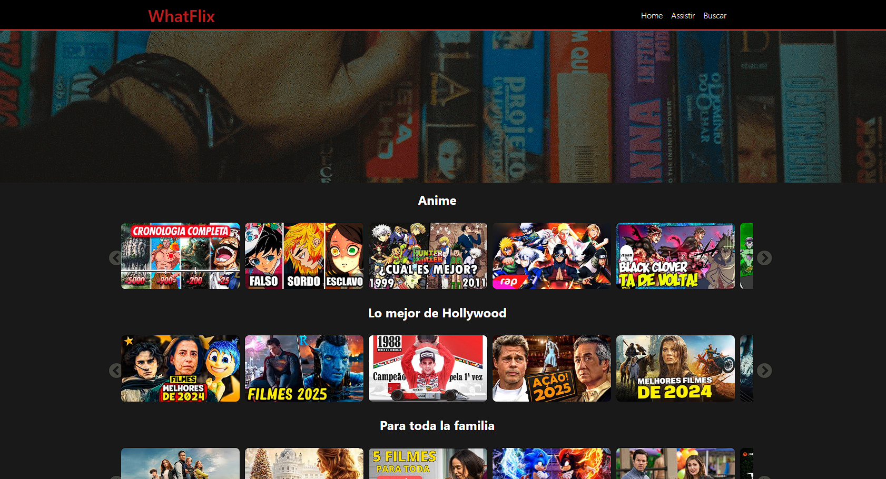

# Proyecto WhatFlix con React y Vite


## 🚀 Descripción
Este Proyecto se realizó como un intento de crear una aplicación web similar a Netflix, donde el usuario pueda encontrar una lista de películas y series, separadas por categorías. En esta aplicación, se utilizaron Vite, React y sus características como: React-Router-Dom, React-Slick y React-Icons.



## 🌟 Funcionalidades
- **Aplicación de Series y Películas**
- **Interfaz interactiva** con React.
- **Enrutamiento** para la navegación entre las páginas.

## 🛠️ Tecnologías Utilizadas
- **React**: Biblioteca JavaScript.
- **React Router**: Gestión de rutas de la aplicación.
- **Vite**: Herramienta de compilación y desarrollo rápido.
- **JSON Server**: Creación de una API local para persistir los datos de costos y gastos.
- **React Icons**: Íconos para la interfaz.
- **React Slick**: Carrusel responsivo para React.
- **React Api**: Api Context.

## 🛠️ Extensiones Utilizadas (Google Chrome)
- **React Context Devtool**;
- **React Developer Tools**;

## ⚙️ Instalación
1. Clona este repositorio:
   ```bash
   git clone https://github.com/YagoCastelao/App-Movies
   
2. Acceda a la carpeta del Proyecto
   ```bash
   cd app-movies
   
3. Instala las dependencias:
   ```bash
   npm install

4. Inicia la aplicación:
   ```bash
   npm run dev

## Contribuyendo
Si deseas contribuir, realiza un fork de este repositorio y envía un pull request.

## Licencia
Este proyecto está bajo la licencia MIT.
